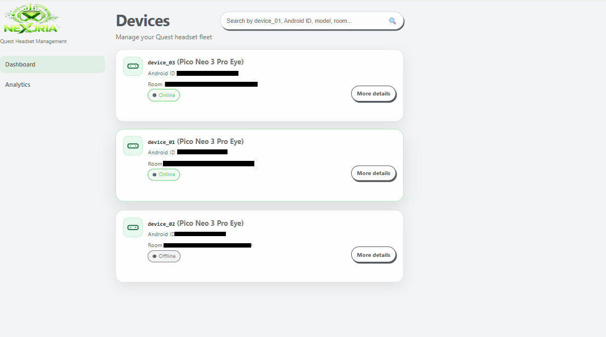
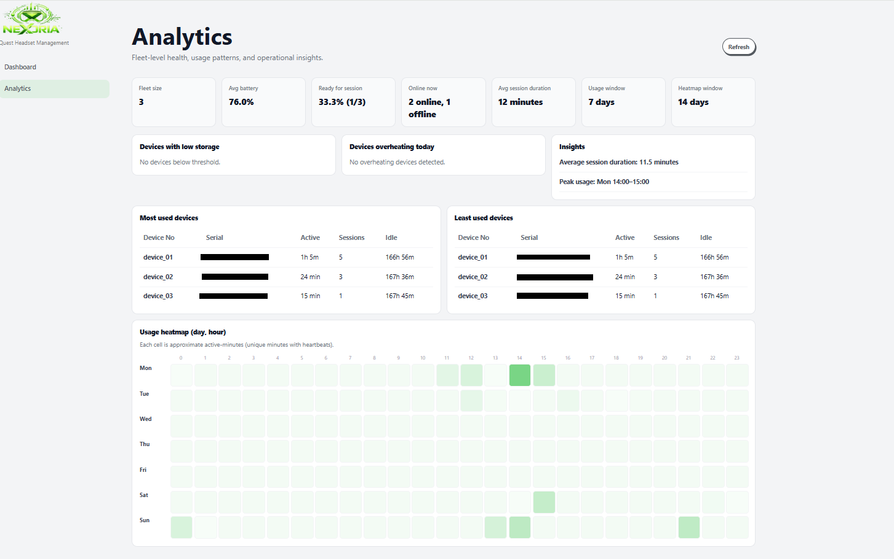
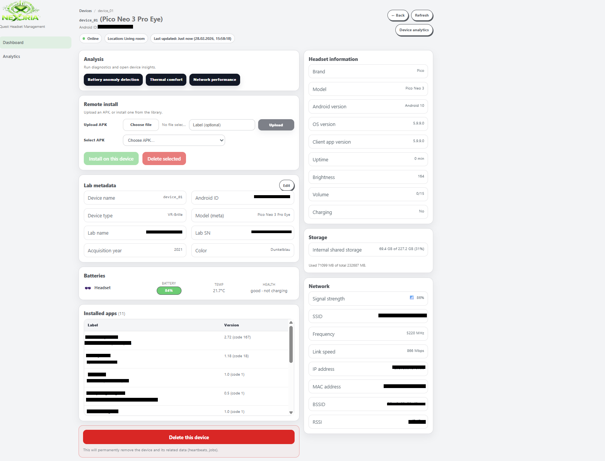
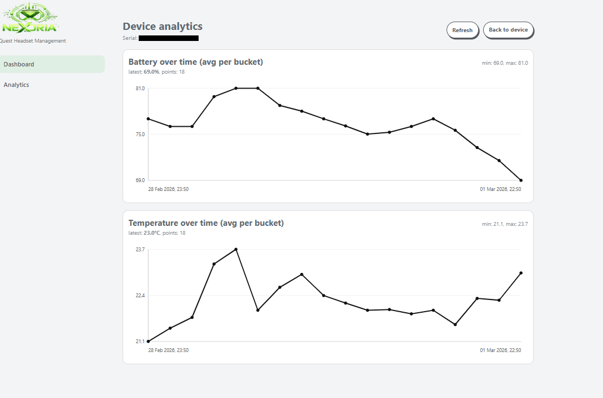
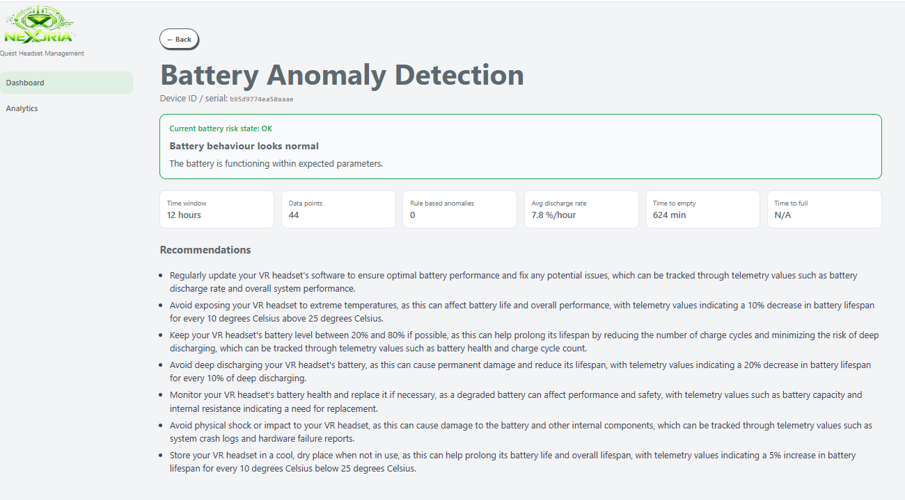
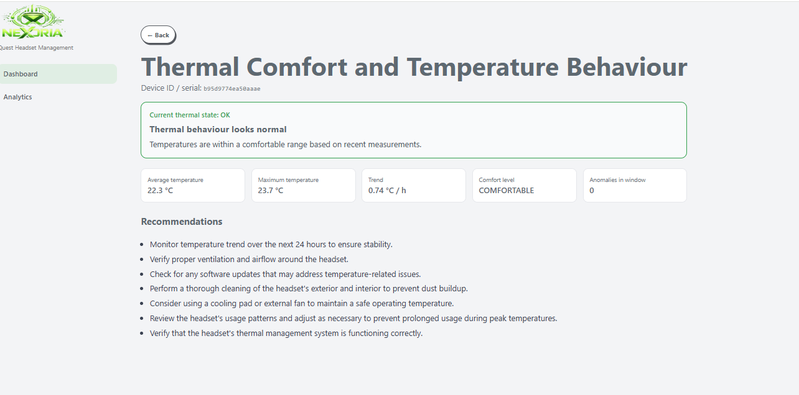
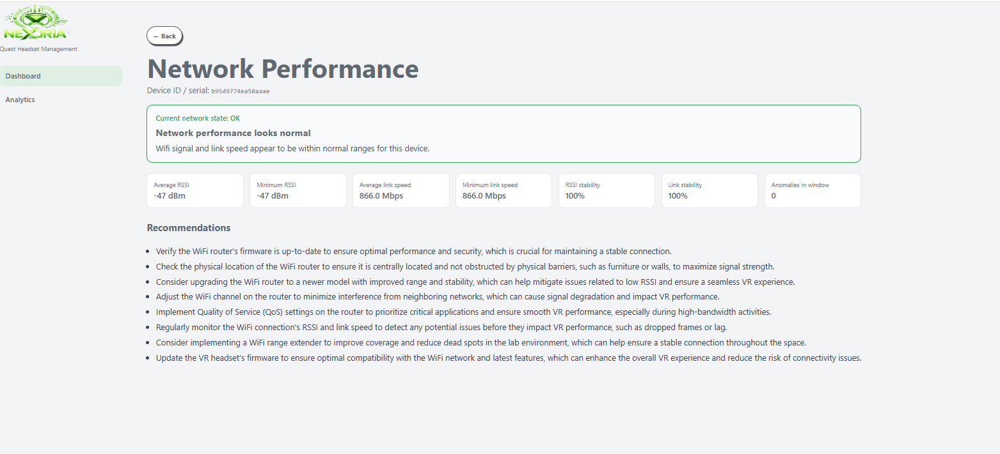

<div align="center">

<br/>

```
███╗   ██╗███████╗██╗  ██╗ ██████╗ ██████╗ ██╗ █████╗
████╗  ██║██╔════╝╚██╗██╔╝██╔═══██╗██╔══██╗██║██╔══██╗
██╔██╗ ██║█████╗   ╚███╔╝ ██║   ██║██████╔╝██║███████║
██║╚██╗██║██╔══╝   ██╔██╗ ██║   ██║██╔══██╗██║██╔══██║
██║ ╚████║███████╗██╔╝ ██╗╚██████╔╝██║  ██║██║██║  ██║
╚═╝  ╚═══╝╚══════╝╚═╝  ╚═╝ ╚═════╝ ╚═╝  ╚═╝╚═╝╚═╝  ╚═╝
```

### Telemetry-Driven VR Fleet Management

*Real-time monitoring · AI anomaly detection · Remote management*

<br/>
</div>

---

## 📡 Overview

**Nexoria** is a telemetry-driven VR fleet management system built for standalone VR headsets. Designed for **educational institutions** and **enterprise environments**, it provides real-time monitoring, AI-assisted anomaly detection, and remote device management — all from a single unified dashboard.

### System Architecture

```
┌────────────────────────────────────────────────────────┐
│                    NEXORIA SYSTEM                      │
│                                                        │
│   ┌──────────────┐       ┌──────────────────────────┐  │
│   │  VR Headsets │ ───►  │   Backend (Flask + Mongo)│  │
│   │  PicoFleet   │       │   · Telemetry Ingestion  │  │
│   │  Agent (APK) │       │   · Anomaly Detection    │  │
│   └──────────────┘       │   · REST API             │  │
│                          └────────────┬─────────────┘  │
│                                       │                │
│                          ┌────────────▼──────────────┐ │
│                          │   Frontend (React + Vite) │ │
│                          │   · Fleet Dashboard       │ │
│                          │   · Analytics & Charts    │ │
│                          │   · Remote Management     │ │
│                          └───────────────────────────┘ │
└────────────────────────────────────────────────────────┘
```

---

## ✨ Features

| Feature | Description |
|---|---|
| 📶 **Real-time Heartbeat** | Continuous monitoring of device status and connectivity |
| 🔋 **Battery Analytics** | Track battery levels, charge cycles, and health trends |
| 🌡️ **Thermal Monitoring** | Detect overheating and thermal anomalies across the fleet |
| 📡 **Network Analytics** | Monitor signal strength, latency, and connectivity drops |
| 🤖 **AI Anomaly Recommendations** | HuggingFace-powered recommendations of irregular device behaviour |
| 📊 **Telemetry Visualization** | Per-device charts and fleet-wide analytics dashboard |
| 📦 **Remote APK Install** | Push and install applications to headsets remotely |
| 🚀 **Scalable Architecture** | Designed to manage large fleets across sites |

---
## 🖼️ Screenshots
 
### Fleet Dashboard — Device List
 
> Browse and manage all registered VR headsets with live online/offline status.
 

 
---
 
### Fleet Analytics
 
> Fleet-level health metrics, usage heatmap, session stats, and operational insights.
 

 
---
 
### Device Dashboard
 
> Deep-dive into a single device — headset info, battery, network, installed apps, and remote APK install.
 

 
---
 
### Device Analytics
 
> Per-device battery and temperature trends over time.
 

 
---
 
### AI Anomaly Detection — Battery
 
> AI-powered battery anomaly detection with discharge rate analysis and actionable recommendations.
 

 
---
 
### AI Anomaly Detection — Thermal
 
> Thermal comfort analysis with temperature trend monitoring and safety recommendations.
 

 
---
 
### AI Anomaly Detection — Network
 
> Network performance diagnostics including RSSI, link speed stability, and optimisation tips.
 


---

## 🧱 Tech Stack

```
Backend          →  Python 3.10+  ·  Flask  ·  MongoDB (Atlas)  ·  HuggingFace
Frontend         →  React 18  ·  Vite  ·  JavaScript
Android Agent    →  Android (Kotlin)  ·  Pico SDK  ·  ADB
```

---

## ⚙️ Prerequisites

Before you begin, ensure the following are installed on your machine:

**Core**
- [Python 3.10+](https://www.python.org/downloads/)
- [Node.js 18+](https://nodejs.org/) and npm
- [Git](https://git-scm.com/)
- [MongoDB Atlas](https://www.mongodb.com/atlas) account (or local MongoDB)

**Android / VR**
- [Android Studio](https://developer.android.com/studio)
- ADB (Android Debug Bridge)
- Pico VR headset with **Developer Mode** enabled

---

## 🚀 Installation & Setup

### 1 — Clone the Repository

```bash
git clone https://github.com/dhool19/nexoria.git
cd nexoria
```
---

### 2 — Backend Setup

```bash
cd nexoria-backend
```

**Create & activate virtual environment**

<details>
<summary>🪟 Windows (PowerShell)</summary>

```powershell
python -m venv venv
.\venv\Scripts\activate
```
</details>

<details>
<summary>🍎 macOS / 🐧 Linux</summary>

```bash
python3 -m venv venv
source venv/bin/activate
```
</details>

**Install dependencies**

```bash
pip install -r requirements.txt
```

**Configure environment variables**

Create a `.env` file inside `nexoria-backend/`:

```bash
# nexoria-backend/.env

MONGODB_URI=your_mongodb_connection_string
HF_TOKEN=your_huggingface_token
BASE_URL=http://127.0.0.1:5000
PORT=5000
```

> 💡 Get your `HF_TOKEN` from [huggingface.co/settings/tokens](https://huggingface.co/settings/tokens)

**Start the backend server**

```bash
python server.py
```

✅ Backend is running at `http://127.0.0.1:5000`

---

### 3 — Frontend Setup

Open a **new terminal**:

```bash
cd nexoria-frontend
npm install
```

**Configure environment variables**

Create a `.env` file inside `nexoria-frontend/`:

```bash
# nexoria-frontend/.env

VITE_API_BASE_URL=http://127.0.0.1:5000
```

**Start the development server**

```bash
npm run dev
```

✅ Frontend is running at `http://localhost:5173`

---

### 4 — Android Agent Setup (PicoFleetAgent)

1. Open **Android Studio**
2. Select **Open Project** → choose the `PicoFleetAgent/` folder
3. Wait for **Gradle sync** to complete
4. Connect your **Pico headset** via USB
5. Enable **USB Debugging** on the device
6. Press **Run** ▶️ in Android Studio

**Or — install via ADB directly:**

```bash
# Check device is connected
adb devices

# Install the APK
adb install app-debug.apk

# Reinstall (if already installed)
adb install -r app-debug.apk
```

---

### 5 — Running the Full System

Open **three terminals** and run each component simultaneously:

```bash
# Terminal 1 — Backend
cd nexoria-backend
.\venv\Scripts\activate   # (Windows) or: source venv/bin/activate
python server.py

# Terminal 2 — Frontend
cd nexoria-frontend
npm run dev

# Terminal 3 — Android Agent
# Run from Android Studio, or install APK via ADB (see above)
```

---

## 👩‍💻 Author

**Ayesha Dhool**

---

## 📄 Legal

Copyright & Trademark © 2026 Ayesha Ahmed Dhool. All rights reserved.

This app and its contents are the exclusive property of Ayesha Ahmed Dhool. Unauthorized reproduction, distribution, or use of any part of this application, including its code, design, and media, is strictly prohibited.

All trademarks, service marks, and logos are the property of their respective owners.

---

<div align="center">

*Built with 💜 for smarter VR fleet management*

</div>